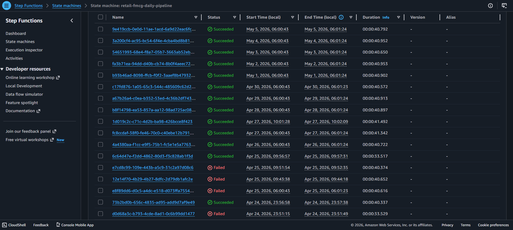
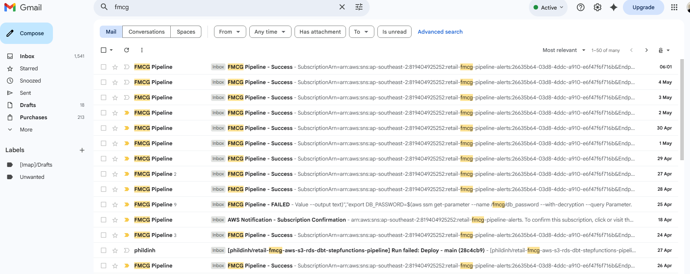
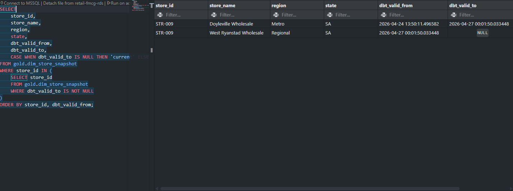
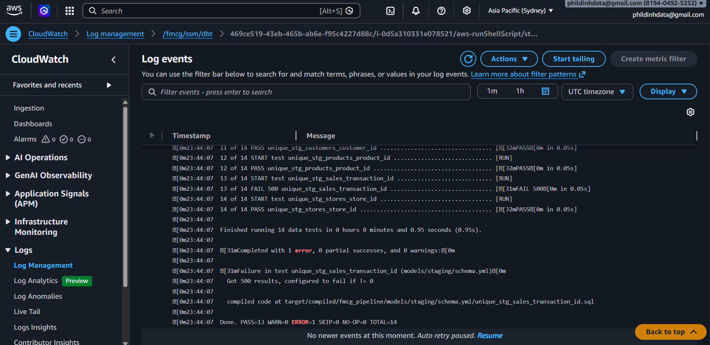
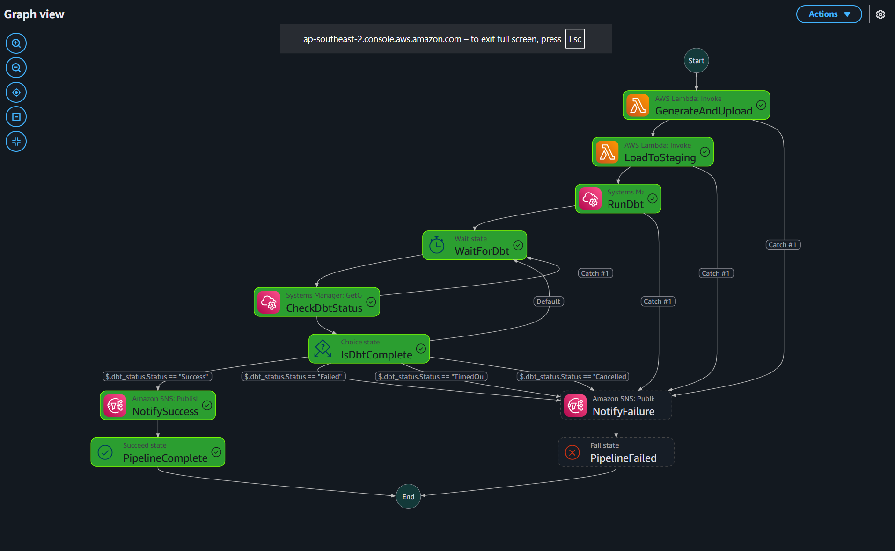
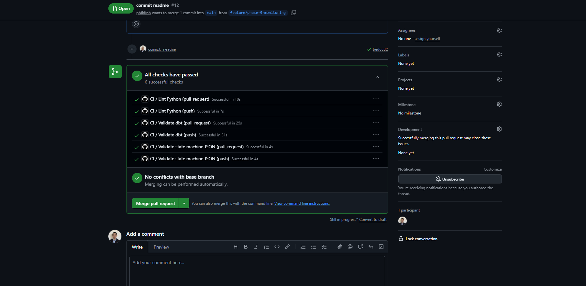
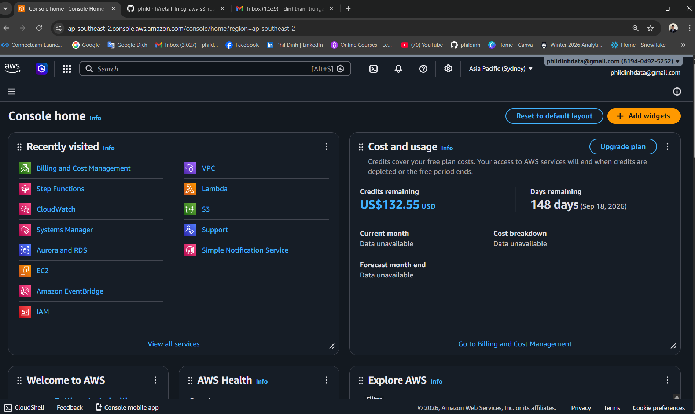
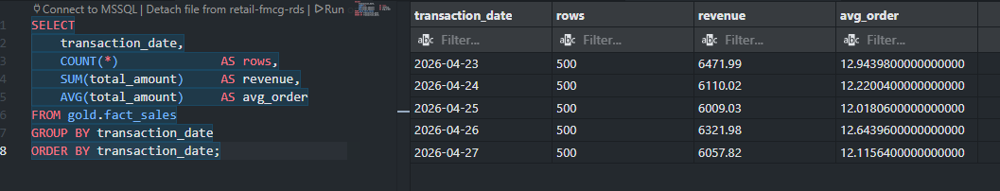
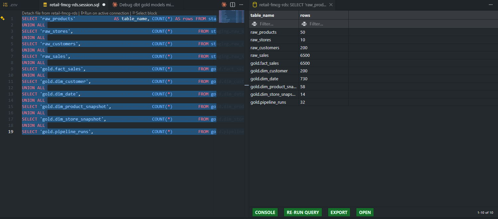

# Retail FMCG AWS Data Pipeline

> A fully automated, production-grade cloud data pipeline built on AWS — with end-to-end observability, automated data quality testing, CI/CD, and real production bugs encountered, diagnosed, and fixed.

---

## What Makes This Project Different

Anyone can follow a tutorial and connect Lambda to RDS. What this project demonstrates is what happens **after** you deploy — when things break silently, when tests catch what your eyes miss, and when you have to diagnose a failure at 6am from an email alert.

### The pipeline ran for 5 consecutive days and tells you when it fails

EventBridge triggers a Step Functions state machine every morning at 6am AEST without human intervention. After 5 consecutive daily runs (Apr 23–27), the pipeline has accumulated **2,500 fact rows** across all tables. When something goes wrong — and things did go wrong — an SNS email lands in your inbox with the exact error. No checking dashboards. No manually running scripts.




### dbt tests caught real bugs before they reached the dashboard

14 automated data quality tests run on every pipeline execution. They caught things that would have silently corrupted the data:

- **Duplicate transaction IDs** — a failed morning run (timezone bug) reloaded April 24 data into a table that already had it. The `unique` test on `transaction_id` failed with 500 results. Without the test, fact_sales would have had 1,000 rows for one day with duplicate keys — and Power BI would have double-counted every metric for that day.
- **Dimension table accumulation** — products, stores and customers were accumulating rows across daily runs instead of replacing them. The `unique` test on `product_id` caught 100 rows (2 × 50 products) instead of 50. Fixed by changing the delete strategy from date-filtered to full-replace.

### SCD Type 2 worked in the real pipeline — not just in theory

On Monday (the first Monday after go-live), `generate.py` automatically changed prices on 2 products and flipped 1 store's region. dbt snapshot detected the changes, expired the old records, and inserted new current versions — exactly as designed.

- `dim_product_snapshot`: 52 rows — 50 current + **2 expired** (price history preserved)
- `dim_store_snapshot`: 11 rows — 10 current + **1 expired** (STR-009 Metro → Regional)

Sales before Monday reference the old price. Sales from Monday onwards reference the new price. Full history, no data loss.



### When tests failed, CloudWatch showed exactly why

SSM streams all dbt output to CloudWatch. When the unique test failed, the full error — including the compiled SQL — was visible in the log within seconds.



### Step Functions actually waits for dbt to finish

The original state machine used `ssm:sendCommand` which returns immediately when SSM **accepts** the command — not when dbt finishes. The pipeline was reporting "Success" before dbt had even started, and failures were completely invisible.

Fixed by adding a polling loop: `WaitForDbt → CheckDbtStatus → IsDbtComplete` that polls every 30 seconds until SSM reports the actual result.



### Real production bugs found and fixed

| Bug | How it was found | Fix |
|---|---|---|
| dbt staging views had same name as raw tables — circular self-reference | `relation does not exist` error on first dbt run | Renamed Lambda 2 tables to `raw_*`, dbt views stay as `stg_*` |
| Step Functions reported success before dbt finished | Pipeline "succeeded" but fact_sales had no new rows | Added SSM polling loop with `WaitForDbt → CheckDbtStatus` |
| `dbt snapshot` ran before staging views existed | Snapshot failed silently, gold models never ran | Snapshots now read from `raw_*` source tables directly, no dependency on staging |
| `max(created_at)` returns NULL on empty table | fact_sales stayed empty after truncate — incremental loaded 0 rows | Added `COALESCE(max(created_at), '1900-01-01')` null guard |
| Lambda used UTC date, EventBridge fires at 20:00 UTC (6am AEST) | Pipeline generated yesterday's data every morning | Fixed Lambda 1 to use `ZoneInfo("Australia/Sydney")` for date resolution |
| SSM parameters are SecureString but fetched without `--with-decryption` | dbt received KMS ciphertext as hostname | Added `--with-decryption` flag to all SSM parameter fetches |
| Lambda packages compiled for local OS, not Amazon Linux | `ModuleNotFoundError: No module named 'dbt'` on Lambda invocation | Deploy script uses `--platform manylinux2014_x86_64 --only-binary=:all:` |
| Duplicate rows from re-running same date with different timestamps | `unique_stg_sales_transaction_id` FAIL 500 in dbt test | Changed delete key from `created_at` timestamp to `transaction_date` |

### CI/CD — every push is validated before it reaches AWS

GitHub Actions runs three checks on every push: Python lint, dbt project parse, and state machine JSON validation. On merge to `main`, both Lambdas are automatically packaged and deployed.



---

## Table of Contents

- [Business Problem](#business-problem)
- [Architecture](#architecture)
- [AWS Services](#aws-services)
- [Tech Stack](#tech-stack)
- [Data Pipeline Flow](#data-pipeline-flow)
- [Database Design](#database-design)
- [Data Engineering Patterns](#data-engineering-patterns)
- [Synthetic Dataset](#synthetic-dataset)
- [CI/CD](#cicd)
- [Project Structure](#project-structure)
- [Setup Guide](#setup-guide)
- [Pipeline Execution](#pipeline-execution)
- [Pipeline in Action](#pipeline-in-action)
- [Monitoring and Alerting](#monitoring-and-alerting)
- [Cost Estimate](#cost-estimate)
- [Production Considerations](#production-considerations)
- [Key Learnings](#key-learnings)

---

## Business Problem

A small FMCG distributor runs their entire data pipeline on a local machine. When the data engineer leaves, the pipeline stops. Stakeholders lose access to daily sales reports. The Power BI dashboard goes stale.

**The solution:** Migrate the entire pipeline to AWS so it:
- Runs automatically every day at 6am AEST — no manual intervention
- Lives in the cloud — accessible by the whole team, not just one laptop
- Stores data in a managed cloud database — team connects from anywhere
- Sends email alerts on success or failure — full observability
- Tracks historical dimension changes — proper SCD Type 2 audit trail

---

## Architecture

```
┌─────────────────────────────────────────────────────────────────┐
│                        AWS Cloud                                │
│                                                                 │
│  ┌─────────────┐    ┌──────────────────────────────────────┐   │
│  │ EventBridge │───▶│         Step Functions               │   │
│  │ 6am AEST    │    │                                      │   │
│  └─────────────┘    │  ┌──────────┐   ┌──────────┐        │   │
│                     │  │Lambda 1  │──▶│Lambda 2  │        │   │
│                     │  │Generate  │   │Load to   │        │   │
│                     │  │+ Upload  │   │Staging   │        │   │
│                     │  └──────────┘   └──────────┘        │   │
│                     │       │               │              │   │
│                     │       ▼               ▼              │   │
│                     │  ┌────────┐    ┌────────────┐        │   │
│                     │  │  S3    │    │    RDS     │        │   │
│                     │  │Bronze  │    │  Staging   │        │   │
│                     │  └────────┘    └────────────┘        │   │
│                     │                      │               │   │
│                     │  ┌───────────────────▼─────────┐     │   │
│                     │  │    EC2 (dbt Core)            │     │   │
│                     │  │  dbt run staging (views)    │     │   │
│                     │  │  dbt snapshot (SCD Type 2)  │     │   │
│                     │  │  dbt run gold (incremental) │     │   │
│                     │  │  dbt test (data quality)    │     │   │
│                     │  └───────────────────┬─────────┘     │   │
│                     │                      │               │   │
│                     │  ┌───────────────────▼─────────┐     │   │
│                     │  │    RDS PostgreSQL (Gold)     │     │   │
│                     │  │    Star Schema               │     │   │
│                     │  └───────────────────┬─────────┘     │   │
│                     │                      │               │   │
│                     │  ┌───────┐    ┌──────▼──────┐        │   │
│                     │  │  SNS  │    │  Power BI   │        │   │
│                     │  │Email  │    │  Dashboard  │        │   │
│                     │  └───────┘    └─────────────┘        │   │
│                     └──────────────────────────────────────┘   │
└─────────────────────────────────────────────────────────────────┘
```

---

## AWS Services

| Service | Purpose | Why Chosen |
|---|---|---|
| **EventBridge** | Daily cron trigger at 6am AEST | Serverless scheduler, near-zero cost |
| **Step Functions** | Pipeline orchestrator — sequences all steps | Native AWS, built-in retry, visual monitoring |
| **Lambda (×2)** | Serverless Python compute | Pay per invocation, no server management |
| **S3** | Raw CSV landing zone (Bronze layer) | Durable, cheap, partitioned by date |
| **RDS PostgreSQL** | Cloud data warehouse | Managed, always-on, team accessible |
| **EC2 (t3.micro)** | Runs dbt Core | Persistent environment needed for dbt |
| **SSM** | Remote command execution on EC2 | Secure, no open ports needed |
| **SNS** | Email alerts on success/failure | Instant observability |
| **CloudWatch** | Centralised logging | Automatic, zero config |
| **IAM** | Roles and permissions | Least privilege per service |



---

## Tech Stack

| Tool | Version | Purpose |
|---|---|---|
| Python | 3.9 | Lambda functions and data generator |
| boto3 | 1.34.x | AWS SDK for S3, Lambda, SNS |
| Faker | 24.x | Synthetic FMCG data generation |
| psycopg2-binary | 2.9.x | PostgreSQL connection from Python |
| pandas | 2.x | Data manipulation in generator |
| dbt Core | 1.10.x | SQL transformations and snapshots |
| dbt-postgres | 1.9.x | dbt adapter for RDS PostgreSQL |
| GitHub Actions | — | CI/CD — lint, validate, deploy |
| Git + GitHub | — | Version control |

---

## Data Pipeline Flow

### Daily Execution (6am AEST)

```
Step 1 — EventBridge fires cron(0 20 * * ? *)
         ↓
Step 2 — Step Functions state machine starts
         ↓
Step 3 — Lambda 1 executes
         • Python + Faker generates 500 daily transactions
         • Produces 4 CSV files (products, stores, customers, fact_sales)
         • Uploads to S3: s3://retail-fmcg-raw-data/{table}/year=/month=/day=/
         ↓
Step 4 — Lambda 2 executes (receives S3 URIs from Lambda 1)
         • Reads each CSV from S3 into memory
         • Dimension tables: full wipe + reload (products, stores, customers)
         • Fact table: idempotent delete by created_at + insert (raw_sales)
         • Logs run to pipeline_runs metadata table
         ↓
Step 5 — Step Functions sends SSM command to EC2, polls until complete
         • dbt run staging  → creates stg_* views on raw_* tables
         • dbt snapshot     → SCD Type 2 on dim_product, dim_store
         • dbt run gold     → builds fact_sales (incremental) + dim tables
         • dbt test         → validates data quality (14 tests)
         ↓
Step 6 — SNS publishes success email
         "Pipeline completed successfully for 2026-04-24. Rows loaded: 760"
```

### On Failure

```
Any step fails → Step Functions catches error
               → SNS publishes failure email with error details
               → CloudWatch logs capture full stack trace
               → pipeline_runs table records failure + error message
```

---

## Database Design

### RDS PostgreSQL — Two Schemas

```
fmcg_db
├── staging schema (Silver — owned by Lambda 2)
│   ├── raw_products    ← full replace each run (master data)
│   ├── raw_stores      ← full replace each run (master data)
│   ├── raw_customers   ← full replace each run (master data)
│   └── raw_sales       ← accumulates daily (watermark for incremental)
│
└── gold schema (Gold — owned by dbt)
    ├── stg_products*         ← dbt view, typed + cleaned
    ├── stg_stores*           ← dbt view, typed + cleaned
    ├── stg_customers*        ← dbt view, typed + cleaned
    ├── stg_sales*            ← dbt view, typed + cleaned
    ├── fact_sales            ← incremental fact table
    ├── dim_product_snapshot  ← SCD Type 2 history
    ├── dim_store_snapshot    ← SCD Type 2 history
    ├── dim_customer          ← SCD Type 1 (overwrite)
    ├── dim_date              ← static date spine (2 years)
    └── pipeline_runs         ← metadata logging

* dbt staging views live in staging schema
```

### Star Schema (Gold Layer)

```
                    ┌─────────────────┐
                    │   dim_date      │
                    │  date_id (PK)   │
                    │  full_date      │
                    │  year/month/day │
                    │  week/quarter   │
                    │  is_weekend     │
                    └────────┬────────┘
                             │
┌──────────────────┐         │         ┌──────────────────┐
│ dim_product      │         │         │ dim_store        │
│ (SCD Type 2)     │         │         │ (SCD Type 2)     │
│ product_id (PK)  │         │         │ store_id (PK)    │
│ product_name     │         │         │ store_name       │
│ category         ├────┐    │    ┌────┤ state/region     │
│ brand/supplier   │    │    │    │    │ store_type       │
│ unit_cost/price  │    │    │    │    │ dbt_valid_from   │
│ dbt_valid_from   │    │    │    │    │ dbt_valid_to     │
│ dbt_valid_to     │    │    │    │    │ dbt_scd_id       │
└──────────────────┘    │    │    │    └──────────────────┘
                        │    │    │
                        ▼    ▼    ▼
              ┌──────────────────────────┐
              │       fact_sales         │
              │  transaction_id (PK)     │
              │  transaction_date        │
              │  product_id (FK)         │
              │  store_id (FK)           │
              │  customer_id (FK)        │
              │  quantity                │
              │  unit_price              │
              │  discount_pct            │
              │  total_amount            │
              │  created_at (watermark)  │
              └──────────────────────────┘
                        │    │
                        │    │
┌──────────────────┐    │    │
│ dim_customer     │    │    │
│ (SCD Type 1)     │◀───┘    │
│ customer_id (PK) │         │
│ age_group        │         │
│ loyalty_tier     │         │
│ state            │         │
└──────────────────┘         │
                             │
                    (dim_date joined
                     on transaction_date)
```

---

## Data Engineering Patterns

| Pattern | Implementation | Where |
|---|---|---|
| **Idempotency** | Dimension tables: full wipe + reload. Fact table: delete by exact `created_at` | Lambda 2 |
| **Incremental load** | `created_at` watermark with `COALESCE` null guard — only new rows | dbt fact_sales |
| **Backfill** | `run_date` parameter accepted by Lambda 1 + 2 via Step Functions | Both Lambdas |
| **SCD Type 2** | dbt snapshots on `raw_*` tables — expire old rows, insert new | dim_product, dim_store |
| **SCD Type 1** | `DISTINCT ON` deduplication — latest record wins | dim_customer |
| **S3 partitioning** | `/year=/month=/day/` folder structure | Lambda 1 |
| **Metadata logging** | Every run logged — status, rows, duration, errors | Lambda 2 + logger.py |
| **Data quality** | 14 dbt tests — unique, not_null | dbt test suite |
| **Retry logic** | Step Functions built-in retry with exponential backoff | State machine |
| **SSM polling** | `WaitForDbt → CheckDbtStatus → IsDbtComplete` loop — waits for real completion | State machine |
| **Alerting** | SNS email on success and failure | Step Functions |
| **Observability** | CloudWatch logs for all Lambda, SSM and dbt runs | Automatic |

---

## Synthetic Dataset

Generated using Python Faker (Australian locale) with `random.seed(42)` for reproducible dimension data.

### Dataset Size

| Table | Records | Refresh |
|---|---|---|
| Products | 50 | Full replace each run (SCD changes on Mondays) |
| Stores | 10 | Full replace each run (SCD changes on Mondays) |
| Customers | 200 | Full replace each run (SCD Type 1) |
| Daily transactions | 500 | New rows appended every day |

### FMCG Categories

| Category | Brands | Price Range |
|---|---|---|
| Beverages | Coca Cola, Pepsi, Schweppes, Red Bull, Bundaberg | $1.50 – $5.00 |
| Snacks | Smiths, Doritos, Pringles, Shapes, Grain Waves | $2.00 – $6.00 |
| Dairy | Pauls, Dairy Farmers, Devondale, Bega, Mainland | $2.50 – $8.00 |
| Bakery | Tip Top, Wonder White, Helgas, Bakers Delight | $3.00 – $7.00 |
| Personal Care | Dove, Palmolive, Head & Shoulders, Colgate | $4.00 – $12.00 |
| Cleaning | Ajax, Domestos, Morning Fresh, Finish, Vanish | $3.50 – $14.00 |

### State Distribution (weighted by population)

| State | Weight |
|---|---|
| NSW | 35% |
| VIC | 25% |
| QLD | 20% |
| WA | 10% |
| SA | 10% |

### SCD Change Simulation

Every Monday the generator simulates realistic dimension changes:
- **2 products** receive price/cost updates
- **1 store** changes region classification

This triggers dbt snapshots to record history — demonstrating real SCD Type 2 behaviour across weeks of pipeline runs.

---

## CI/CD

GitHub Actions runs two workflows on every push.

### CI — runs on every push and pull request to `main`

Three parallel jobs:

| Job | What it checks |
|---|---|
| **Lint Python** | flake8 across all Lambda, utils, and test files |
| **Validate dbt** | `dbt parse` — validates all SQL and YAML without a database connection |
| **Validate state machine JSON** | Confirms `state_machine.json` is valid JSON |


### CD — runs on push to `main` only

Two sequential jobs:

| Job | What it does |
|---|---|
| **Deploy Lambdas** | Packages both Lambdas with dependencies (manylinux platform for psycopg2), deploys to AWS |
| **Sync dbt to EC2** | SCPs updated models, snapshots, macros and `dbt_project.yml` to EC2 |

---

## Project Structure

```
retail-fmcg-aws-s3-rds-dbt-stepfunctions-pipeline/
│
├── data_generator/
│   ├── generate.py              # Synthetic data generator
│   ├── README.md
│   └── output/                  # Local CSV output (gitignored)
│
├── lambda/
│   ├── README.md
│   ├── lambda_1_generator/
│   │   ├── handler.py           # Lambda 1 — generate + upload to S3
│   │   └── requirements.txt     # Faker, pandas, python-dotenv
│   └── lambda_2_staging/
│       ├── handler.py           # Lambda 2 — S3 to RDS staging
│       └── requirements.txt     # psycopg2-binary, python-dotenv
│
├── dbt/
│   ├── README.md
│   └── fmcg_pipeline/
│       ├── dbt_project.yml
│       ├── macros/
│       │   └── generate_schema_name.sql
│       ├── models/
│       │   ├── staging/         # stg_* views on raw_* tables
│       │   └── gold/            # fact_sales, dim_customer, dim_date
│       └── snapshots/           # SCD Type 2 — dim_product, dim_store
│
├── step_functions/
│   └── state_machine.json       # Step Functions state machine
│
├── infrastructure/
│   ├── README.md
│   ├── setup_rds.py             # Creates RDS schemas and tables
│   └── deploy_lambdas.py        # Packages and deploys Lambdas to AWS
│
├── utils/
│   ├── config.py                # Environment variable loader
│   ├── db.py                    # RDS connection and query helpers
│   ├── s3.py                    # S3 upload/download helpers
│   └── logger.py                # pipeline_runs metadata logging
│
├── tests/
│   ├── test_lambda_1.py         # Local integration test for Lambda 1
│   └── test_lambda_2.py         # Local integration test for Lambda 2
│
├── docs/
│   └── screenshots/             # Pipeline screenshots
│
├── .github/
│   └── workflows/
│       ├── ci.yml               # Lint + validate on every push
│       └── deploy.yml           # Deploy on push to main
│
├── sync_dbt.ps1                 # Sync local dbt files to EC2
├── requirements.txt             # Full dev dependencies
└── README.md
```

---

## Setup Guide

### Prerequisites

- Python 3.9+
- AWS account with credits
- Power BI Desktop
- VS Code
- Git

### 1. Clone the Repository

```bash
git clone https://github.com/phildinh/retail-fmcg-aws-s3-rds-dbt-stepfunctions-pipeline.git
cd retail-fmcg-aws-s3-rds-dbt-stepfunctions-pipeline
```

### 2. Create Virtual Environment

```bash
python -m venv venv
venv\Scripts\Activate.ps1   # Windows
pip install -r requirements.txt
```

### 3. Configure Environment Variables

```bash
cp .env.example .env
# Fill in your AWS credentials and RDS details
```

### 4. Configure AWS CLI

```bash
aws configure
# Enter: Access Key, Secret Key, Region (ap-southeast-2), Format (json)
```

### 5. Create RDS Schema and Tables

```bash
python infrastructure/setup_rds.py
```

### 6. Deploy Lambda Functions

```bash
python infrastructure/deploy_lambdas.py
```

### 7. Set Up dbt on EC2

```bash
# SSH into EC2
ssh fmcg-ec2

# Install dbt
pip install dbt-core dbt-postgres psycopg2-binary

# Configure profiles.yml with RDS credentials
mkdir -p ~/.dbt
nano ~/.dbt/profiles.yml
```

### 8. Sync dbt Project to EC2

```powershell
.\sync_dbt.ps1
```

### 9. Store RDS credentials in SSM Parameter Store

```bash
aws ssm put-parameter --name /fmcg/db_host     --type SecureString --value "your-rds-endpoint"
aws ssm put-parameter --name /fmcg/db_user     --type SecureString --value "your-db-user"
aws ssm put-parameter --name /fmcg/db_password --type SecureString --value "your-db-password"
```

### 10. Deploy Step Functions and EventBridge

Paste `step_functions/state_machine.json` into the AWS Console:
**Step Functions → Create state machine → paste JSON → Save**

Then create the daily trigger:
**EventBridge → Rules → Create rule → schedule `cron(0 20 * * ? *)` → target: state machine ARN**

### 11. Add GitHub Secrets for CI/CD

In GitHub: **Settings → Secrets and variables → Actions**, add:

| Secret | Description |
|---|---|
| `AWS_ACCESS_KEY_ID` | AWS credentials |
| `AWS_SECRET_ACCESS_KEY` | AWS credentials |
| `AWS_REGION` | `ap-southeast-2` |
| `S3_BUCKET` | S3 bucket name |
| `DB_HOST` / `DB_NAME` / `DB_USER` / `DB_PASSWORD` / `DB_PORT` | RDS connection |
| `SNS_TOPIC_ARN` | SNS topic ARN |
| `NUM_TRANSACTIONS` | `500` |
| `PIPELINE_ENV` | `dev` |
| `EC2_HOST` | EC2 public IP or DNS |
| `EC2_SSH_KEY` | Contents of your `.pem` key file |

---

## Pipeline Execution

### Manual Trigger via AWS Console

Go to **Step Functions → Start execution** and pass:

```json
{
  "run_date": "2026-04-23",
  "run_timestamp": "2026-04-23 06:00:00"
}
```

### Backfill a Specific Date

Same as above — just change the date. Lambda 1 generates data for that date, Lambda 2 loads it, dbt picks it up via the incremental watermark.

### Local Testing

```bash
# Test data generator locally
python data_generator/generate.py

# Test Lambda 1 locally (requires AWS credentials)
python tests/test_lambda_1.py

# Run dbt manually on EC2
ssh fmcg-ec2
cd /home/ec2-user/dbt/fmcg_pipeline
export DB_HOST=$(aws ssm get-parameter --name /fmcg/db_host --with-decryption --query Parameter.Value --output text)
export DB_USER=$(aws ssm get-parameter --name /fmcg/db_user --with-decryption --query Parameter.Value --output text)
export DB_PASSWORD=$(aws ssm get-parameter --name /fmcg/db_password --with-decryption --query Parameter.Value --output text)
dbt run --select staging --profiles-dir ~/.dbt
dbt snapshot --profiles-dir ~/.dbt
dbt run --select gold --profiles-dir ~/.dbt
dbt test --profiles-dir ~/.dbt
```

---

## Pipeline in Action

### Step Functions — state machine graph

Every step is visible in real time. The polling loop (`WaitForDbt → CheckDbtStatus → IsDbtComplete`) waits for dbt to actually finish before reporting success.


### Step Functions — execution history

Multiple daily runs visible with success/failure status and duration.


### SNS email alerts

Pipeline sends a success or failure email after every run.


### fact_sales — 5 consecutive days accumulating

500 rows per day appended via the `created_at` incremental watermark. After 5 daily runs (Apr 23–27) the table holds 2,500 transactions with full revenue history.



### SCD Type 2 — store region change on Monday

STR-009 (Doyleville Wholesale, SA) changed region from **Metro → Regional** on Monday. dbt snapshot closed the old record (`dbt_valid_to = 2026-04-27`) and inserted a new current record (`dbt_valid_to = NULL`). Historical sales before Monday still reference Metro. Sales from Monday onwards reference Regional.


### Database row counts — after 5 days of live runs

| Table | Rows | What it means |
|---|---|---|
| `raw_sales` | 2,500 | 5 days × 500 transactions accumulated |
| `gold.fact_sales` | 2,500 | Full incremental history |
| `gold.dim_product_snapshot` | 52 | 50 current + 2 expired (Monday price changes) |
| `gold.dim_store_snapshot` | 11 | 10 current + 1 expired (Monday region change) |
| `gold.pipeline_runs` | 24 | Every run logged — including test and failed runs |



---

## Monitoring and Alerting

### SNS Email Alerts

| Event | Subject | Message |
|---|---|---|
| Success | `FMCG Pipeline - Success` | Run date, rows loaded |
| Failure | `FMCG Pipeline - FAILED` | Full state detail for debugging |

### CloudWatch Log Groups

```
/aws/lambda/retail-fmcg-lambda-1-generator
/aws/lambda/retail-fmcg-lambda-2-staging
/fmcg/ssm/dbt
```

All dbt stdout and stderr is streamed to `/fmcg/ssm/dbt` on every pipeline run. When a test fails, the exact error, the failing model, and the compiled SQL are all visible in the log — no SSH into EC2 needed.


### Pipeline Runs Table

```sql
SELECT
    run_id,
    run_date,
    status,
    rows_loaded,
    finished_at - started_at AS duration,
    error_message
FROM gold.pipeline_runs
ORDER BY run_id DESC;
```

### dbt Test Results

14 automated data quality tests covering:
- `unique` constraints on all primary keys
- `not_null` constraints on all foreign keys and critical columns

---

## Cost Estimate

| Service | Monthly Cost |
|---|---|
| RDS PostgreSQL (db.t3.micro) | ~$20 |
| EC2 (t3.micro) | ~$10 |
| S3 (< 1GB) | ~$0.02 |
| Lambda (< 1M invocations) | Free tier |
| Step Functions | Free tier |
| EventBridge | Free tier |
| SNS (< 1000 emails) | Free tier |
| **Total** | **~$30/month** |

> Costs covered by AWS credits for this portfolio project.

---

## Production Considerations

This project is built for a dev/portfolio environment. Production enhancements would include:

| Area | Dev (this project) | Production |
|---|---|---|
| IAM policies | FullAccess for simplicity | Least privilege custom policies |
| RDS access | Public + 0.0.0.0/0 for Lambda | Private VPC + Lambda inside VPC |
| SSL | Force SSL disabled for Power BI | SSL enforced with certificate rotation |
| Secrets | SSM Parameter Store | AWS Secrets Manager |
| File format | CSV (simple, debuggable) | Parquet (compressed, typed) |
| EC2 | Always on | Stop/start schedule to save cost |
| dbt | Single EC2 instance | dbt Cloud or MWAA |
| Monitoring | CloudWatch + SNS email | CloudWatch dashboards + PagerDuty |

---

## Key Learnings

### Architecture Decisions

**Why Step Functions over Airflow?**
Single daily pipeline with sequential steps — Step Functions is serverless, near-zero cost, and native to AWS. Airflow on EC2 adds infrastructure cost and complexity that isn't justified for one pipeline. At 5+ pipelines with complex dependencies, Airflow becomes the right choice.

**Why EC2 for dbt instead of Lambda?**
dbt needs a persistent file system for its project files, compiled SQL, and profiles. Lambda's ephemeral storage resets after every run. EC2 keeps everything installed and ready.

**Why RDS over Redshift?**
Small dataset (500 rows/day), simple batch processing, direct Power BI connection needed. Redshift is optimised for massive analytical queries — overkill here. RDS PostgreSQL provides all needed SQL capabilities at a fraction of the cost.

**Why CSV over Parquet in S3?**
Simple pipeline, small data, direct load to PostgreSQL. Parquet requires pyarrow in Lambda and conversion before loading to RDS. CSV loads directly with psycopg2. Production would use Parquet for compression and type safety.

**Why separate `raw_*` tables from `stg_*` views?**
Lambda 2 loads raw data into physical tables (`raw_*`). dbt creates views (`stg_*`) on top that apply type casting and renaming. Naming them the same caused a circular self-reference — the view tried to read from itself. Separating the names makes the ownership clear: Lambda owns `raw_*`, dbt owns `stg_*`.

---

## Author

**Phil Dinh**
Data Engineer | Sydney, Australia

- GitHub: [github.com/phildinh](https://github.com/phildinh)
- LinkedIn: [linkedin.com/in/phil-dinh](https://www.linkedin.com/in/phil-dinh/)

---

## License

MIT License — feel free to use this project as a reference for your own data engineering work.
